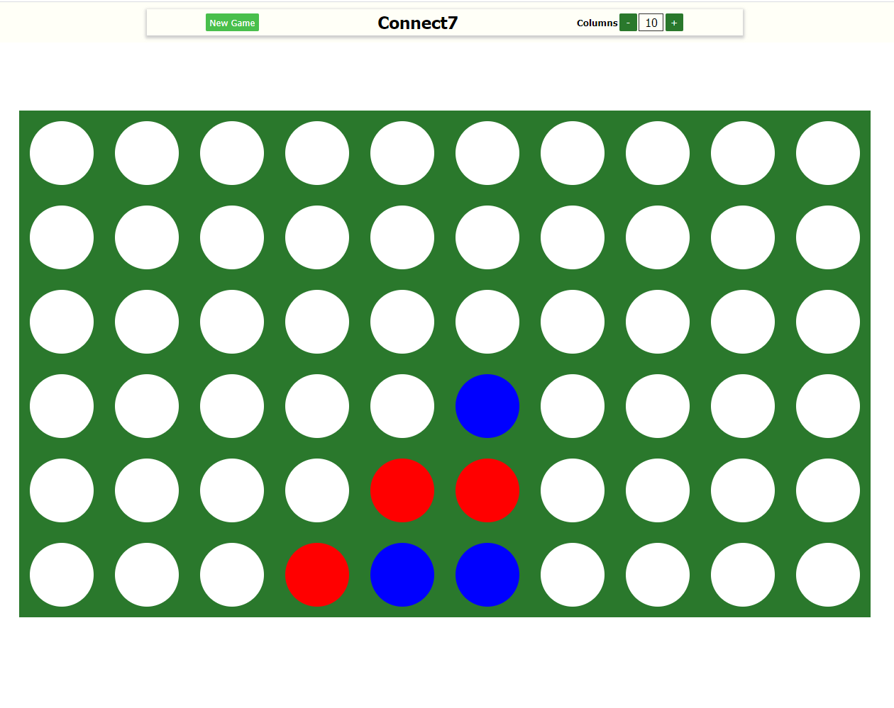

# Connect4 - expendable version

In this mini-project, I've created the classic two-player connection game, Connect4, with jQuery.
As a bonus feature the users can add additional columns to increase the difficulty level of the game.
By adding a column, the players automatically have to connect one additional brick, so that it becomes connect5, connect6 ... etc.



The project is made with jQuery and SCSS.

## Usage

```html
Clone the repository and open the index.html file in your browser
```

## License

[MIT](https://choosealicense.com/licenses/mit/)
